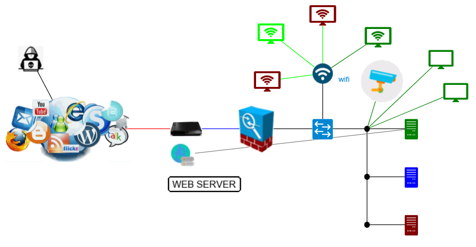

# Lab Simulator

This lab simulator is a python flask application that simulate endpoint infection for SecureX Demonstrations.

This is actually a tiny web server that listen on http port 4000. This one is supposed to be installer into your laptop.

The simulator exposes a Web GUI that is a network diagram we can interact with. The simulator manages interaction with your SecureX tenant as well.

This GUI simulates an endpoint infection which create incidents and sightings into your SecureX Tenant. Exactly like what happen with real infections. The same alerts are created within SecureX.

The goal is to showcase endpoint infection safely without doing it with real attacks and malwares.

## Installation

Create a working directory into your laptop. Open a terminal window into it.

### Clone the scripts

You must have a git client installed into your laptop. Then you can type the following command

	git clone https://github.com/pcardotatgit/lab_simulator-001.git
	cd lab_simulator-001-main\code
	
If you don't have a git client, then just download the zip package from the github repository and unzip it into your working directory.

### Create a Python virtual environment

For Linux/Mac 

	python3 -m venv venv
	source /bin/activate

For Windows 

	python -m venv venv 
	venv/Scripts/activate

### install needed modules

you can install them with the following  :
	
	python -m pip install --upgrade pip
	pip install -r requirements.txt

### Start the simulator

	python app.py

