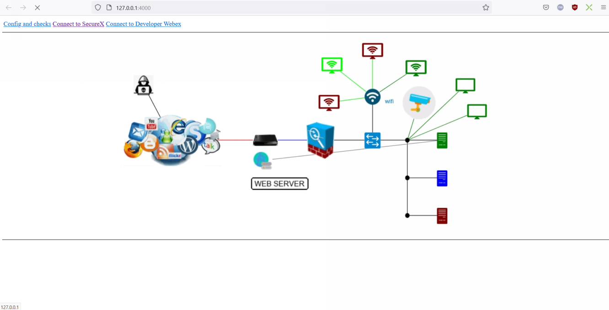

# Lab Simulator ( v_20230514 )

This lab simulator is a python flask application that simulate endpoint infection for SecureX / Cisco XDR Demonstrations.

This is actually a tiny web server that listen on http port 4000. This one is supposed to be installed into your laptop.

The simulator exposes a Web GUI that is a network diagram we can interact with. The simulator manages interaction with your SecureX tenant as well.

This GUI simulates an endpoint infection which create incidents and sightings into your SecureX Tenant. Exactly like what happen with real infections. The same alerts are created within SecureX.

The goal is to showcase endpoint infection safely without doing it with real attacks and malwares.

## Installation

A Pre requisit before moving forward on the lab simulator installation is to have a python interpreter installed and running into your laptop.

If you are not sure of this, then open a terminal console and type the following command :

	python -V

The result of this command is the version of your installed python interpreter. This version must be at least 3.7. 

If you don't have any python interpreter then you have to install one.

If your laptop is a windows machine the install **Python for Windows** ( don't forget to click on the [ add python to path] checkbox ). Python 3.7 was the version used for this lab. For this only reason it is the recommended version to install. 

If your python interpreter is correctly working, then you are good to go to next steps.

Next step ...

### Create a working directory

Create a working directory into your laptop. Open a terminal window into it. Name It **PVT_Lab** for example.

### Copy the code into your laptop

**Download ZIP Method**

The most easy way for anyone not familiar with git is to copy the **ZIP** package available for you in this page. Click on the **Code** button on the top right of this page. And then click on **Download ZIP**. 

Unzip the zip file into your working directory.

**Or clone the code with a git client**

And here under for those of you who are familiar with Github.

You must have a git client installed into your laptop. Then you can type the following command from a terminal console opened into your working directory.

	git clone https://github.com/pcardotatgit/lab_simulator-001.git

### Go to the code subfolder

Once the code unzipped into your laptop, then Go to the **code** subfolder.

	cd lab_simulator-001-main\code
    
### Quick Start for windows user

This section is only for windows users. In order to make installation steps easier some batch file had been prepared for you.  You just have to run them one after the other.
    
You must have a CMD console openned into your code folder :

    c:\path_to_working_directory\working_directory\lab_simulator-001-main\code
    
Then type one after the other the batch files

    install1
    install2
    install3
    install4

And then you can start the simulator by typing :

    b
    
This installation steps must be done only once. 

After that when you will want to run quickly the simulator you will just need to type :

    a
For starting the python virtual environment

and then :

    b

For starting the simulator    

### step by step installation : 1 Create a Python virtual environment

It is still a best practice to create a python virtual environment. Thank to this you will create a dedicated package with requested modules for this application.

For Linux/Mac 

	python3 -m venv venv
	source /bin/activate

For Windows 

	python -m venv venv 

You can type

	install1 and then Enter. This runs a windows batch script

This create the python virtual environment

And then type :

	venv\Scripts\activate

You can type

	b and then Enter. This runs a windows batch script

### step by step installation : 2 Install needed modules

you can install them with the following 2 commands one after the other :
	
	python -m pip install --upgrade pip

For windows users you can type :

	c which runs a windows batch file

Then install required python modules

	pip install -r requirements.txt

For windows users you can type :

	d which runs a windows batch file 

### step by step installation : 3 Start the simulator

	python app.py

For windows users you can type :

	start which runs a windows batch file which start the simulator

At this point you should see the flask application starting into the console and then your browser must open on the Lab Portal page.

This web server listens to port 4000. At anytime you can open the index page at http[://]localhost:4000.

You can **stop the flask application** by typing Ctrl+C into the application console.

### Navigate into the network

Instructions for SecureX / Cisco XDR interaction are given into the [Detect, Alert and Block Threat Use Case](https://github.com/pcardotatgit/SecureX_Workflows_and_Stuffs/tree/master/100-SecureX_automation_lab) lab.

If you click into the hacker icon you will see a cmd console opens.

You can type anything into the edit field.

## Start the simulator when python package is already done :

Open a CMD console into the code folder and type :

    a
For starting the python virtual environment

and then :

    b

For starting the simulator  

Ready to go !